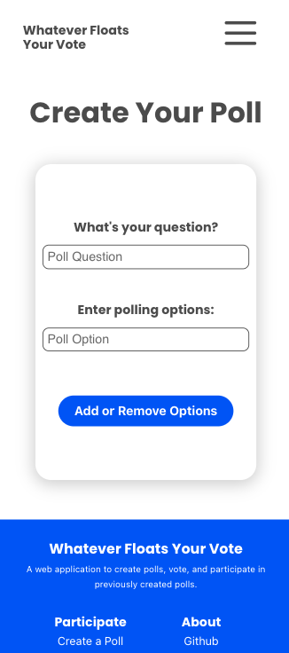

# ⛵"Whatever Floats Your Vote"🗳️
[Link to live site](https://whatever-floats-your-vote-v2.netlify.app/)

## Project Description
Create an app that allows people to take a quick anonymous poll. Users should be able to create a polling room that can be shared with anyone who should take part in the poll. The poll creator should be able to keep track of how many people have voted and then get or display the secret results. Results are stored within Firebase.

## Note:
This is a refactored version of a group project that was worked on at Juno College. After graduation, I wanted to take the opportunity to push what could be done with such a universally useful application and apply some new things learned post-grad.

[Original Repo](https://github.com/Code-Conjurers/Voting-Booth) | [Original Live Site](https://whatever-floats-your-vote.netlify.app/)

## Changes Made
- more consistent image, colours, and branding
- reworked home page for marketing
- hide Firebase sensitive data within .env
- multiple polling options (add and delete options during creation) (previously only limited to two polling options)
- performance optimization
- page and component refactoring

## Installs
1. npm install
2. npm install sweetalert2
3. npm i @ramonak/react-progress-bar
4. npm i sass
5. npm install firebase
6. npm i --save @fortawesome/fontawesome-svg-core
7. npm i --save @fortawesome/free-solid-svg-icons
8. npm i --save @fortawesome/free-regular-svg-icons
9. npm i --save @fortawesome/react-fontawesome@latest

## Original Contributor Credits:
A collaborative app built at [Juno College of Technology](https://junocollege.com/).
- Fiona Freemark | [Github](https://github.com/fionafreemark) | [Portfolio](https://freemark.dev/)
- Chris O'Bray | [Github](https://github.com/nobrayn) | [Portfolio](https://nobrayn.com/)
- Libby Reeves | [Github](https://github.com/libbyreeves) | [Portfolio](https://elizabeth-reeves.ca/)
- Caryl Tan | [Github](https://github.com/caryltan) | [Portfolio](https://caryltan.com/)

## Built With 
- React.js
- Firebase
- git/Github
- Miro

## Packages Installed
- [Sweet Alert](https://sweetalert2.github.io/)
- [React Progress Bar](https://www.npmjs.com/package/@ramonak/react-progress-bar)
- [Sass](https://www.npmjs.com/package/sass)

## Image Asset Credits
- [Undraw](https://undraw.co/)
- [SVG Repo](https://www.svgrepo.com/svg/427580/approved-aproved-confirm-2)
- [React Icons](https://react-icons.github.io/react-icons/)
- [Font Awesome](https://fontawesome.com/)
- [Freepik, Author: "Stories"](https://www.freepik.com/author/stories)

## v1 Screenshots
<table>
  <tr>
     <td></td>
    <td></td>
    <td></td>
    <td></td>
    <td></td>
  </tr>
</table>

## v2 Screenshots
<table>
    <td>
    <td>
    <td>
    <td>
    <td>
    <td>
    <td>
</table>
